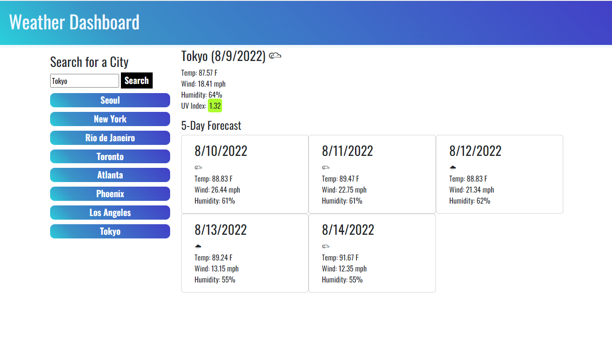

# Challenge-6: Weather Dashboard

[Link to deployed application](https://kieferjackson.github.io/weather-dashboard/)

## Purpose
Third-party APIs enable developers to have access to data which can be used to build interactive or informative applications using this data. Dynamic data is advantageous in a number of situations, but dynamic weather data will be used for this application to build a website that provides up-to-date weather information.

## Design
The OpenWeather API requires the longitude and latitude of a city in order to obtain its current weather conditions and forecasts. Obviously, it is not user friendly for a user to have to enter that information, so instead, the user can enter the name of a city which acts as a key for the City object to access its longitude and latitude. One obvious limitation of this is that only the defined cities can have their weather data fetched. 

Any cities which are searched and are on the list of cities can be easily accessed by a button that is generated to select that city's weather. What cities have been selected are saved to local storage so that a user can quickly view the weather for any cities in the future.

Here is a screenshot of the finished application:
    